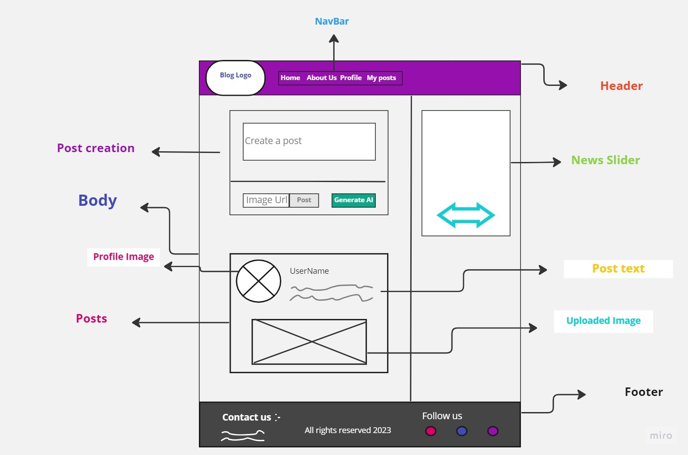
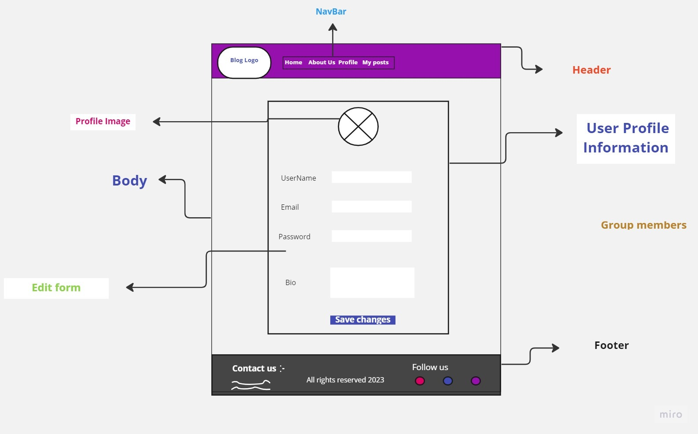
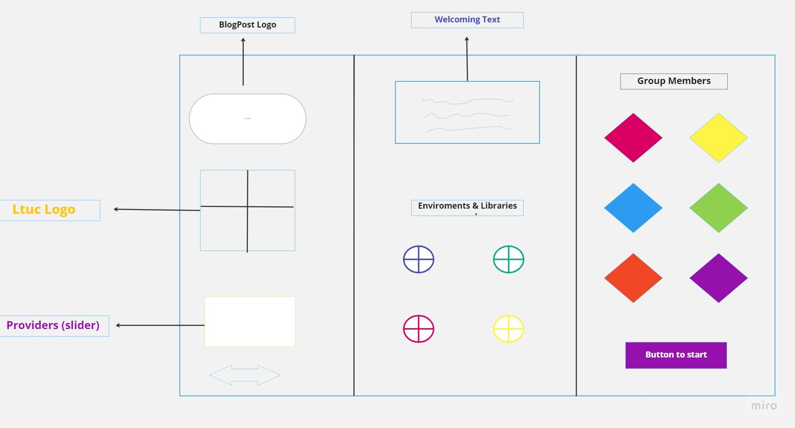
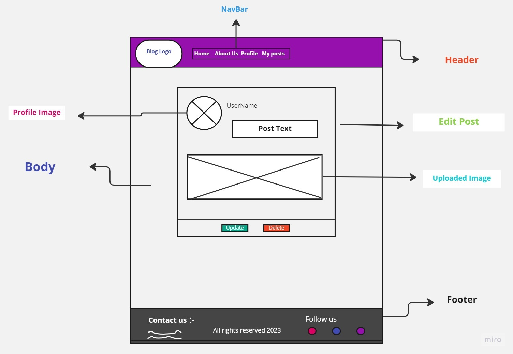
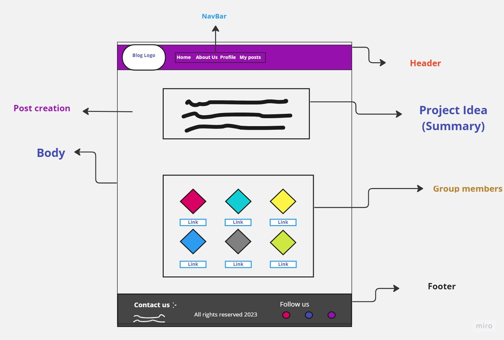

# Blogify-Front-end

**This is the Frontend for Blogify website which is  a platform where users can post blogs with pictures, titles, and content. What makes Blogify unique is that users can optionally use GPT3 to generate content for their blog posts. This means that users can save time and effort by letting GPT3 write their content for them.**

**we used Bootstrap, ReactJS, and Material UI. These technologies help to create an intuitive and user-friendly interface that users can easily navigate. Users can create new posts, view existing posts, and interact with other users by leaving likes and comments. Even unregistered guests can view posts on the platform, but they cannot create new posts or interact with existing posts beyond leaving likes.**

## [Click to see Blogify ^_^](https://main--chipper-platypus-a810ef.netlify.app/)

##  [The Backend Repo](https://github.com/DohaKhamaiseh/Blogify-Backend/tree/main)

## The Wireframes:

